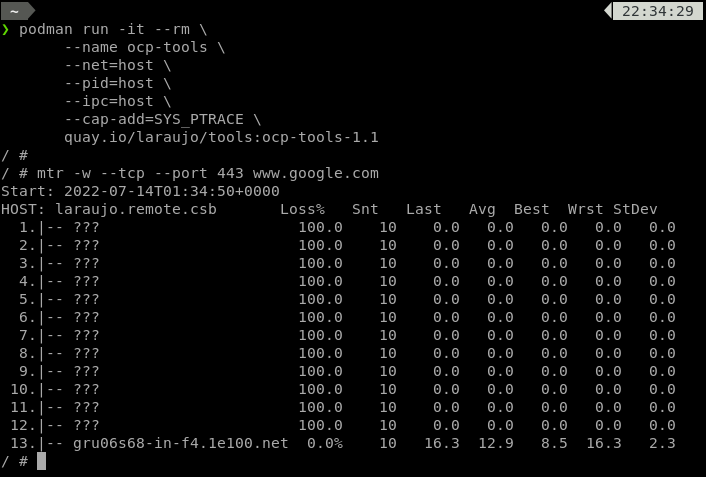

# **OCP TOOLS**

## Description

This image was created with the objective of supporting the analysis of network problems in different environments, below is a list of tools that are contemplated in this image.

## Packages

- [x] Bind-tools
- [x] cURL
- [x] iptraf-ng
- [x] iperf3
- [x] iotop
- [x] iftop
- [x] nload
- [x] mtr
- [x] jq
- [x] netcat-openbsd
- [x] net-tools
- [x] openssh-client
- [x] python3
- [x] sysstat
- [x] tcpdump
- [x] tshark
- [x] strace
- [x] inetutils-telnet
- [x] nmap
- [x] fio
- [x] nfs-utils
- [x] aws-cli
- [x] aws-cli-bash-completion
- [x] vim
- [x] oc-cli
- [x] kubectl

## Usage

### Image pull

```bash
   podman pull quay.io/laraujo/tools:ocp-tools-1.1
```

#### Run
```bash
   podman run -it --rm \
       --name ocp-tools \
       --net=host \
       --pid=host \
       --ipc=host \
       --cap-add=SYS_PTRACE \
       quay.io/laraujo/tools:ocp-tools-1.1
```

## Example


